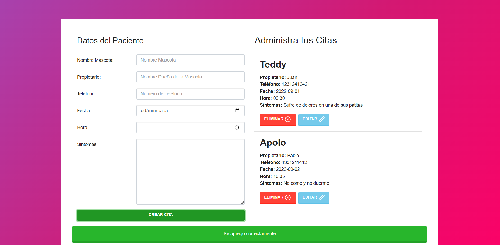
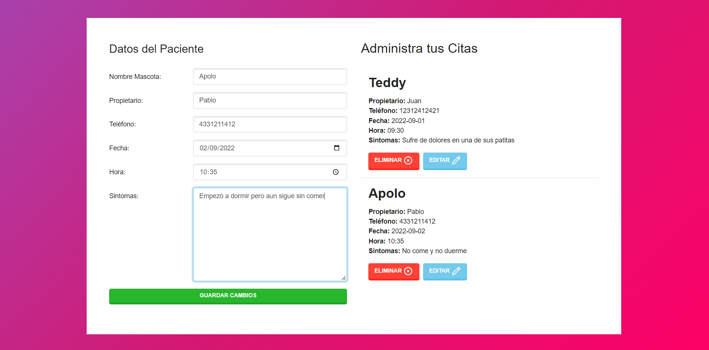
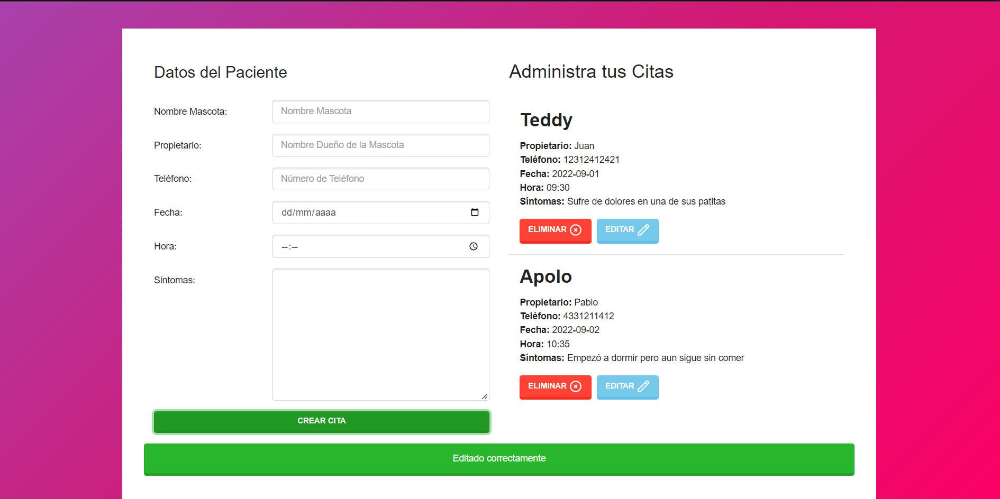
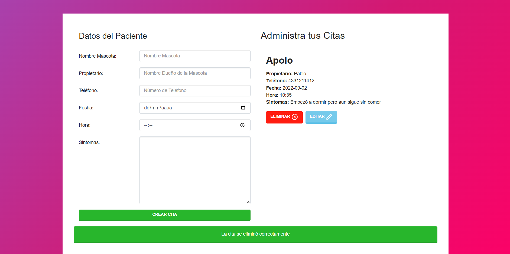

# Administrador de citas de veterinaria
Este es un administrador de citas de pacientes para una veterinaria que utiliza IndexDB como base de datos para la persistencia de los datos de los pacientes.

## Screenshots
Podemos agregar cuantas citas sean necesarias 

Podemos editar las citas en caso de ser necesario 

Y finalmente también podemos eliminar las citas completando un CRUD

